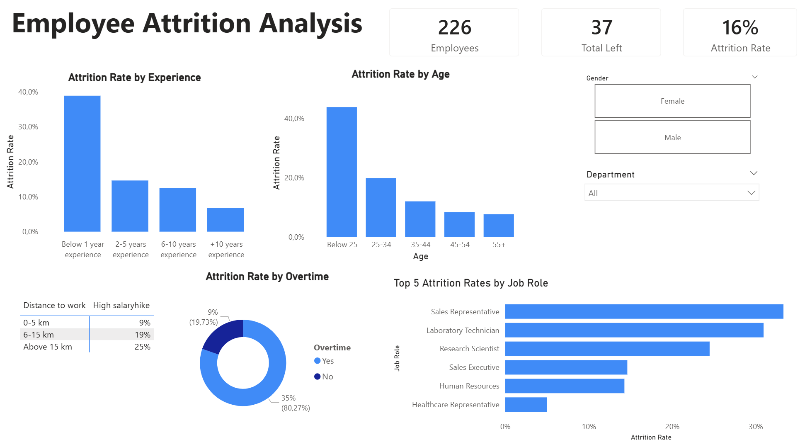

 📊 Employee Attrition Analysis (HR Analytics)

----- 📌 Project Overview -----
-  This project aims to analyze employee turnover and identify the core drivers behind it. By connecting raw data with SQL and visualizing it in Power BI, I discovered that attrition isn't just about compensation, but is tied to burnout, predictable schedules, and commute distances.

----- 🛠️ Tools Used ----- 

- SQL: Data cleaning and feature engineering

- Power BI: Data visualization and interactive dashboard design

----- 👁️ Dashboard Preview -----
 

----- 💡 Key Business Insights & 🚀 Recommended Actions -----

1.The commute vs Salary Dilemma
- Despite receiving the highest salary hikes, top performers still show a high attrition rate (25%) due to long commute distances.
  Recommended Actions to Improve Retention:
* Implement a hybrid or fully remote work model: Allow top performers to work from home to completely eliminate commute-related fatigue.
* Introduce commuter benefits: Provide fuel reimbursement, company cars, or travel allowances to offset the costs and frustration of long-distance daily commutes.

2.OVertime Burnout
- Employees who regularly work overtime show a significantly higher attrition rate, which strongly indicates burnout.
Recommended Actions to Mitigate Burnout:
* Implement predictable work schedules: Ensure strict workload management to eliminate the need for constant overtime.
* Promote Work-Life Balance: Cap weekly overtime hours and encourage managers to redistribute tasks more evenly across the team.

3. Early Attrition Risk 
- Early attrition is a critical issue: employees with less than 1 year of experience exhibit the highest turnover rate in the company.
Recommended Actions to decrease Early Attrition:
* Enhance Onboarding & Development: Implement clear career pathways, provide access to continuous learning resources, and establish transparent criteria for future salary hikes.
* Foster Company Culture: Organize regular team-building events to strengthen internal relationships and build loyalty among new hires.
